# Medical Image Generation for Rare Diseases using Deep Reinforcement Learning

> **Recommended GitHub repository name:** `rare-disease-drl-image-generation`

## Project Architecture

<p align="center">
  
</p>

## Notebook Visual Results

These figures were extracted directly from `dl-project-drl-notebook.ipynb` so they are visible on GitHub without opening the notebook.

### HAM10000 Class Imbalance

<p align="center">
  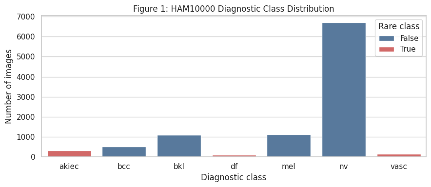
</p>

### Conditional GAN Training Curves

<p align="center">
  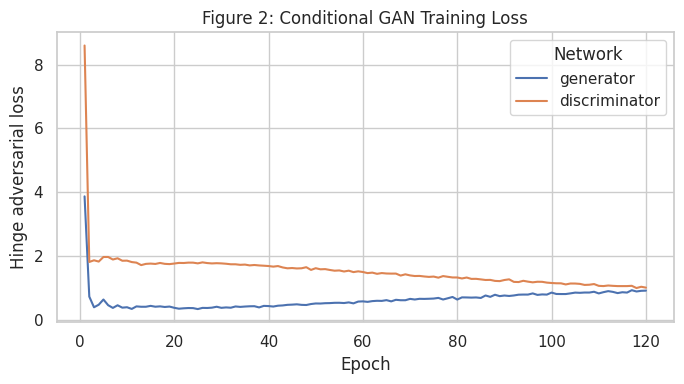
  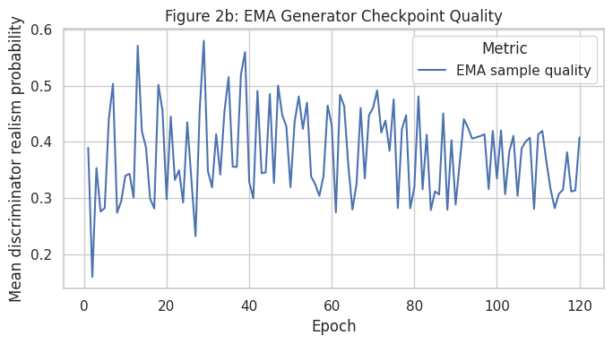
</p>

### Generated cGAN Samples

<p align="center">
  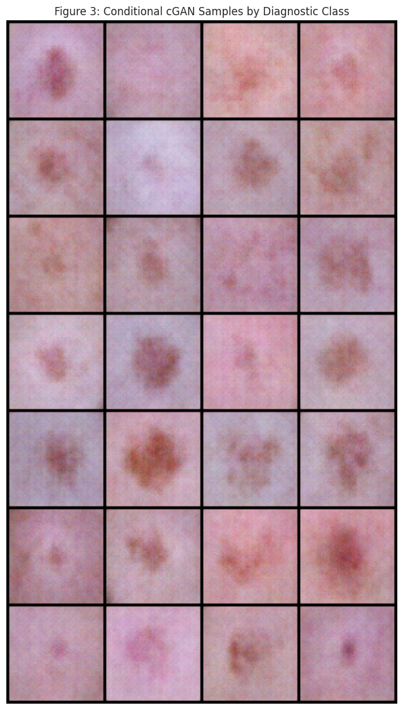
</p>

### Classifier Evaluation

<p align="center">
  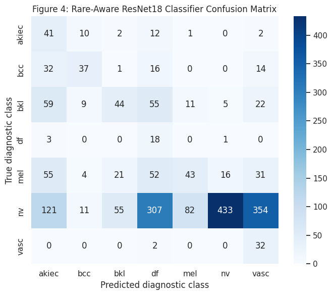
</p>

### PPO Training and Quantitative Results

<p align="center">
  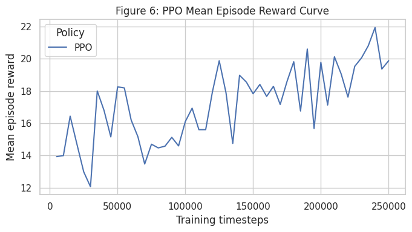
</p>

<p align="center">
  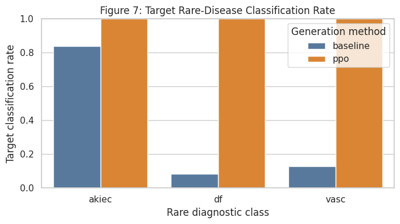
  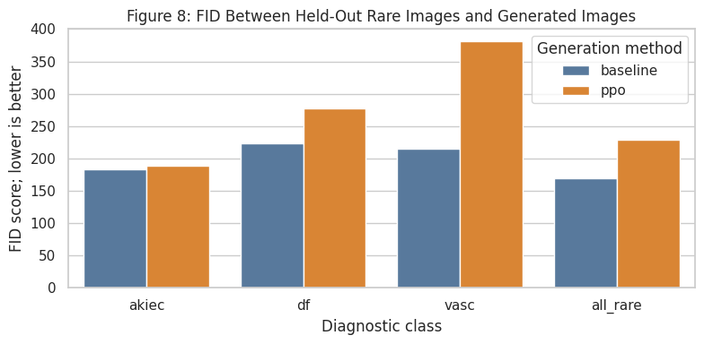
</p>

### Feature-Space Visualization

<p align="center">
  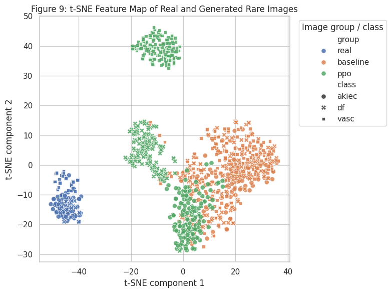
</p>

### Baseline vs PPO Sample Grids

<p align="center">
  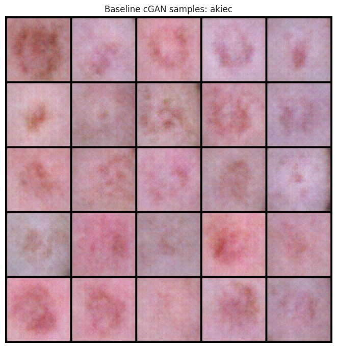
  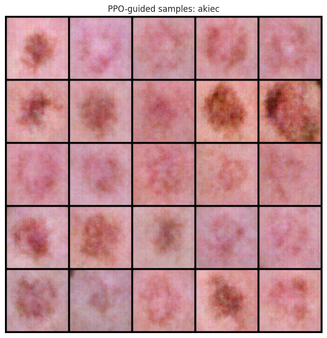
</p>

<p align="center">
  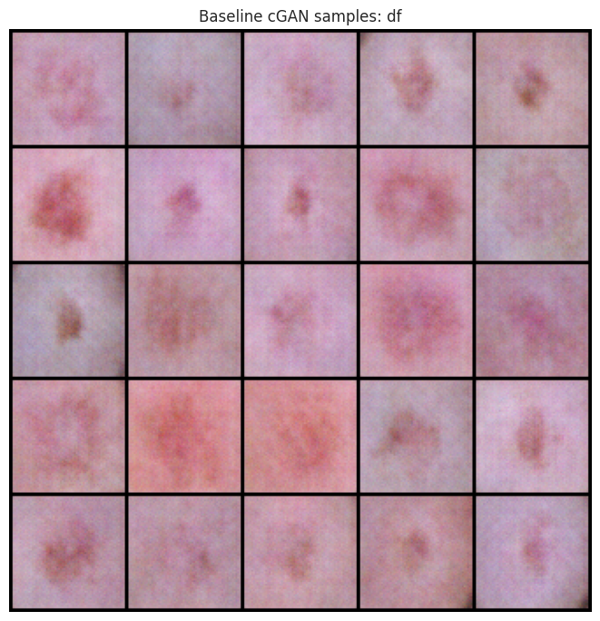
  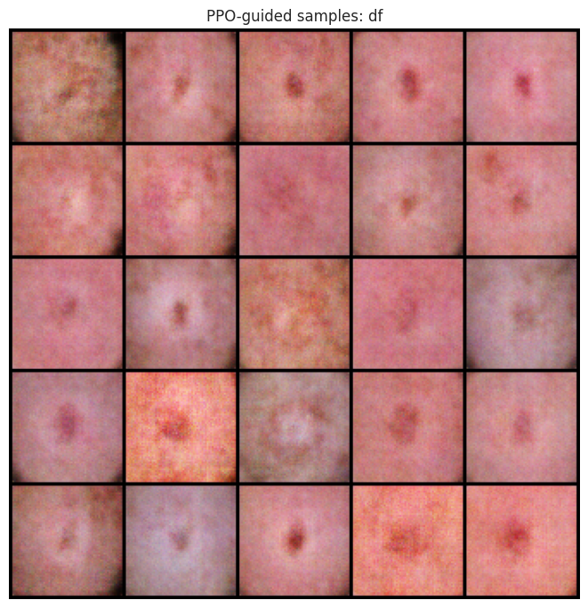
</p>

<p align="center">
  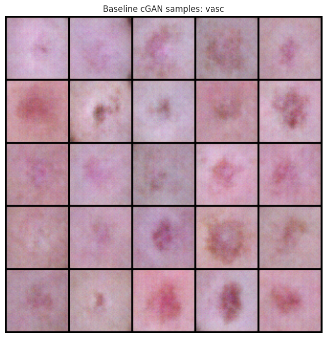
  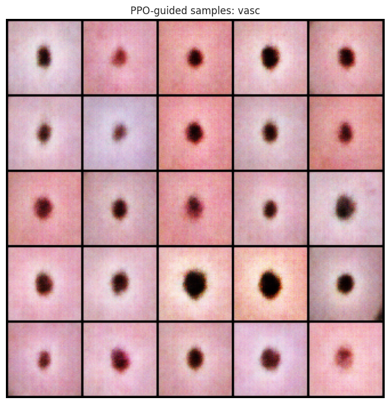
</p>

## Overview

This repository contains a Deep Reinforcement Learning university project for **medical image generation of rare skin diseases** using the HAM10000 dataset.

The project combines:

- **Conditional GAN** for label-aware skin lesion image generation.
- **ResNet18 medical classifier** for diagnostic feedback.
- **PPO reinforcement learning agent** for latent-space navigation.
- **Rare-class balancing** for underrepresented disease categories.
- **Quantitative evaluation** using target classification rate, classifier confidence, and FID.

The main goal is to improve rare disease image generation by guiding the generator toward latent regions that produce medically recognizable rare-class samples.

## Repository Name Suggestions

Best option:

```text
rare-disease-drl-image-generation
```

Other strong names:

- **`drl-medical-rare-disease-generation`**
- **`rl-guided-medical-image-generation`**
- **`rare-lesion-generation-ppo-cgan`**
- **`ham10000-rare-disease-drl`**

## Project Objective

Medical datasets often suffer from class imbalance. In HAM10000, rare lesion classes such as `akiec`, `df`, and `vasc` contain far fewer images than common classes such as `nv`.

This project addresses that limitation by training a conditional generative model and then using reinforcement learning to search the latent space for better rare-disease samples.

## Target Rare Classes

| Class | Meaning | Role |
|---|---|---|
| `akiec` | Actinic keratoses and intraepithelial carcinoma | Rare target class |
| `df` | Dermatofibroma | Rare target class |
| `vasc` | Vascular lesions | Rare target class |

## Methodology

### 1. Data Preparation

The project uses the **HAM10000** dataset.

Preprocessing includes:

- Image resizing.
- Train/validation split.
- Class mapping.
- Rare-class identification.
- Class-balanced sampling.
- Stronger augmentation for rare classes.

### 2. Conditional GAN

A conditional GAN learns to generate skin lesion images conditioned on the diagnostic class label.

The improved notebook uses:

- Hinge adversarial loss.
- R1 regularization.
- DiffAugment-style augmentation.
- EMA generator checkpointing.
- Class-balanced GAN training.

### 3. Medical Classifier

A ResNet18 classifier is trained to recognize the seven HAM10000 lesion classes.

The classifier is used as an internal evaluator for reinforcement learning.

It provides:

- Target-class confidence.
- Predicted class label.
- Feature embeddings.
- Rare-class feature prototypes.

### 4. PPO Reinforcement Learning Agent

The PPO agent operates in the GAN latent space.

At each step, it modifies the latent vector `z` and receives a reward based on:

- Target-class confidence.
- Correct rare-class prediction.
- Discriminator realism.
- Similarity to real rare-class feature prototypes.
- Latent movement penalty.
- Boundary penalty.

### 5. Evaluation

The project compares:

- **Baseline cGAN:** random latent sampling.
- **PPO-guided cGAN:** reinforcement learning guided latent search.

Metrics:

| Metric | Goal | Meaning |
|---|---:|---|
| Target Rate | Higher is better | Percentage of generated images classified as the requested rare disease |
| Mean Target Confidence | Higher is better | Average classifier confidence for the requested class |
| FID | Lower is better | Distributional similarity between real and generated images |

## Latest Completed Run Results

The following table summarizes the latest completed run from `rare_generation_summary.csv`.

| Class | Method | Target Rate | Mean Target Confidence | FID |
|---|---:|---:|---:|---:|
| `akiec` | baseline | 0.717 | 0.458 | **174.566** |
| `akiec` | PPO | **1.000** | **0.873** | 182.291 |
| `df` | baseline | 0.008 | 0.031 | **197.144** |
| `df` | PPO | **1.000** | **0.768** | 217.628 |
| `vasc` | baseline | 0.442 | 0.421 | **172.439** |
| `vasc` | PPO | **1.000** | **0.986** | 174.631 |

## Result Interpretation

The PPO-guided generator achieved a very strong target-class recognition rate:

- `akiec`: **100%**
- `df`: **100%**
- `vasc`: **100%**

However, the FID score increased for PPO-generated images. This indicates that PPO strongly optimized classifier recognition, but some generated samples moved away from the real image distribution.

To address this, the current notebook version includes a more balanced reward function that combines:

- Target confidence.
- Realism.
- Feature-prototype similarity.
- Diversity-aware candidate selection.

This makes the project more scientifically correct because the objective is not only to maximize classifier confidence, but also to preserve realism and distributional quality.

## Current Notebook Version

The main notebook is:

```text
dl-project-drl-notebook.ipynb
```

The latest improved experiment version is:

```text
rare_aware_v11_fid_balanced
```

This version focuses on balancing:

- Rare-class recognition.
- Image realism.
- Feature-distribution similarity.
- Diversity.
- FID improvement.

## Project Structure

```text
DL-PROJECT/
├── dl-project-drl-notebook.ipynb
├── rare_generation_summary.csv
├── assets/
│   └── architecture.svg
└── README.md
```

## How to Run on Kaggle

### 1. Create a Kaggle Notebook

Open Kaggle and create a new notebook.

Upload:

```text
dl-project-drl-notebook.ipynb
```

### 2. Add Dataset

Add the HAM10000 dataset:

```text
kmader/skin-cancer-mnist-ham10000
```

### 3. Enable GPU

Recommended accelerator:

```text
GPU T4 / P100 / A100
```

### 4. Enable Internet

Internet should be enabled because the notebook installs required packages.

### 5. Run Full Experiment

Use:

```python
RUN_MODE = "full"
USE_CACHED = False
```

Then run all cells.

## Main Dependencies

The notebook installs and uses:

- Python
- PyTorch
- TorchVision
- Gymnasium
- Stable-Baselines3
- scikit-learn
- seaborn
- matplotlib
- pytorch-fid
- tqdm

## Main Techniques

- Conditional GAN
- Deep Reinforcement Learning
- PPO
- Latent-space optimization
- Rare-class oversampling
- Focal loss
- Temperature scaling
- Feature-prototype reward shaping
- FID evaluation

## Academic Contribution

This project demonstrates how reinforcement learning can be used to guide generative models toward underrepresented medical categories.

The key idea is:

> Instead of generating rare disease images randomly, an RL agent learns how to navigate the generator latent space toward more diagnostically useful rare-class samples.

## Limitations

This is a research and educational project. It is not intended for clinical diagnosis.

Important limitations:

- Generated images are synthetic.
- Classifier confidence is not equivalent to medical correctness.
- HAM10000 is imbalanced.
- FID can be unstable for small rare-class sample sizes.
- Human medical validation would be required for clinical use.

## Author

Developed as a Deep Reinforcement Learning university project by **MOHAMED EL OUARDI** and **BOUCHOUA YOUSSEF**, supervised by Mr. Badr HIRCHOUA (ENSAM, Filière IAGI2).

## License

This project is intended for academic and educational use.
